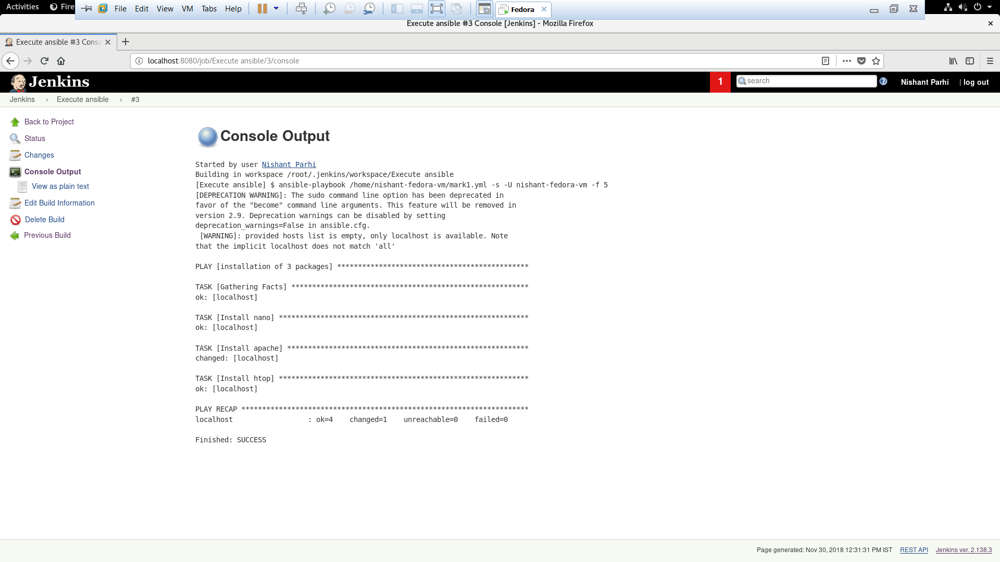

# Ansible-in-jenkins

Execute an ansible-playbook from jenkins

**How to run a ansible-playbook on jenkins.**
 
1) Run the jenkins server, and go to http://localhost:(Your-port)
2) After the login you need to create a job, and then name it.
3) The project should be in freestyle mode.
4) You will be now presented with a form, go to "Build" and in the drop menu select `invoke ansible playbook`, in the path box type the path of the playbook and save it.
5) Now on the project dashboard click on the build now option.
6) After some seconds you will find a box on the left side, Build History.
7) If the ball has turned blue, VOILA!. If it tuned red then there must be an error while running, try troubleshooting.
8) Click on the Build on the history, and it takes you to another page. On that page click console output to see you results.

